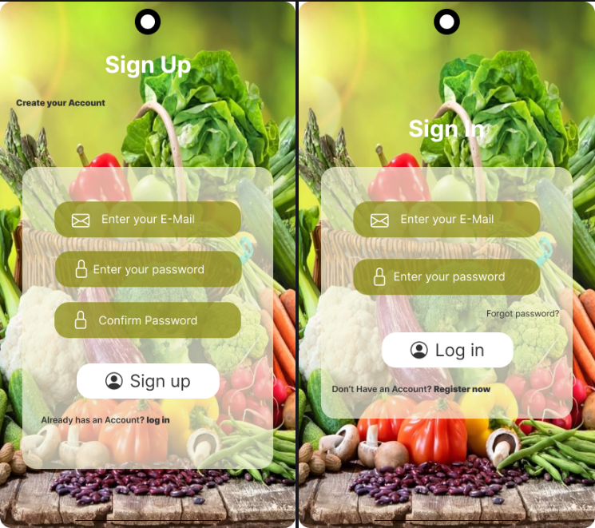

# 🍽️ Flutter Recipe App

Eine moderne **Rezept-App** entwickelt mit **Flutter** und **Dart**,  
die es Benutzern ermöglicht, sich zu registrieren, anzumelden und internationale Gerichte nach Ländern und Kategorien zu entdecken.  

---

## 🚀 Features

### 🔐 Authentifizierung
- Registrierung mit **E-Mail** und **Passwort**  
- Anmeldung für bestehende Benutzer  
- Sichere Speicherung mit **Firebase Authentication**  

### 🍱 Kategorien & Gerichte
- Anzeige von **Essenskategorien** aus verschiedenen Ländern (z. B. Italienisch, Asiatisch, Arabisch, Deutsch …)  
- Innerhalb jeder Kategorie: **Gerichte mit Bildern, Beschreibung und Zutatenliste**  
- **Suchfunktion** nach Kategorie oder Gerichtenamen  
- Filterung und dynamische Anzeige  

### ❤️ Favoriten
- Nutzer kann Gerichte zu **Favoriten** hinzufügen oder entfernen  
- Favoriten werden **persistiert** (lokal gespeichert oder mit Firebase synchronisiert)

### ⚙️ Einstellungen
- **Profilbild hochladen** (Galerie oder Kamera)  
- **Dark Mode** 🌙 / **Light Mode** ☀️ umschalten  
- Benutzerinformationen anzeigen und bearbeiten  

### 📱 UI & Design
- **Responsives Layout** (optimiert für Android & iOS)  
- **Material Design 3** mit modernen Widgets  
- Animationen, Icons und intuitive Navigation  

---

## 🛠️ Verwendete Technologien

| Komponente | Beschreibung |
|-------------|--------------|
| **Flutter (3.x)** | Cross-Platform Framework |
| **Dart** | Programmiersprache für Flutter |
| **Firebase Auth** | Benutzerregistrierung & Login |
| **Cloud Firestore** | Speicherung von Benutzer- und Rezeptdaten |
| **Firebase Storage** | Profilbilder & Rezeptbilder |
| **Provider / Riverpod** | State Management |
| **Shared Preferences** | Lokale Speicherung (z. B. Dark Mode, Favoriten) |

---

